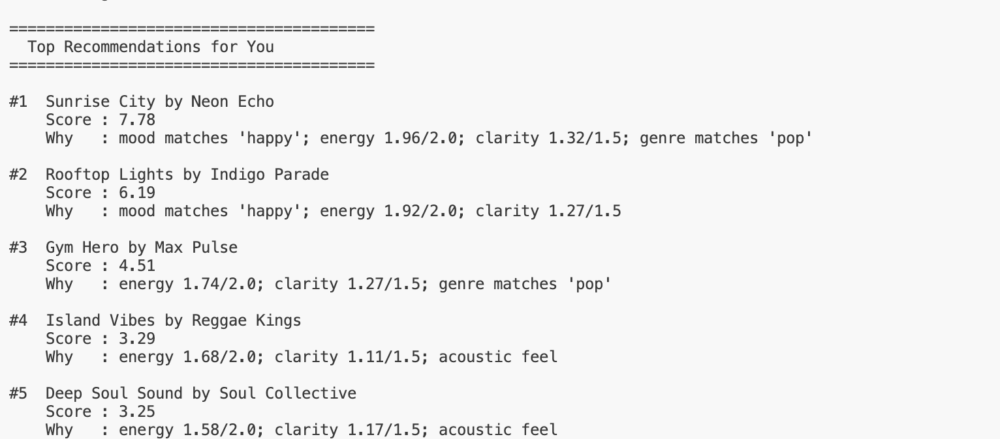
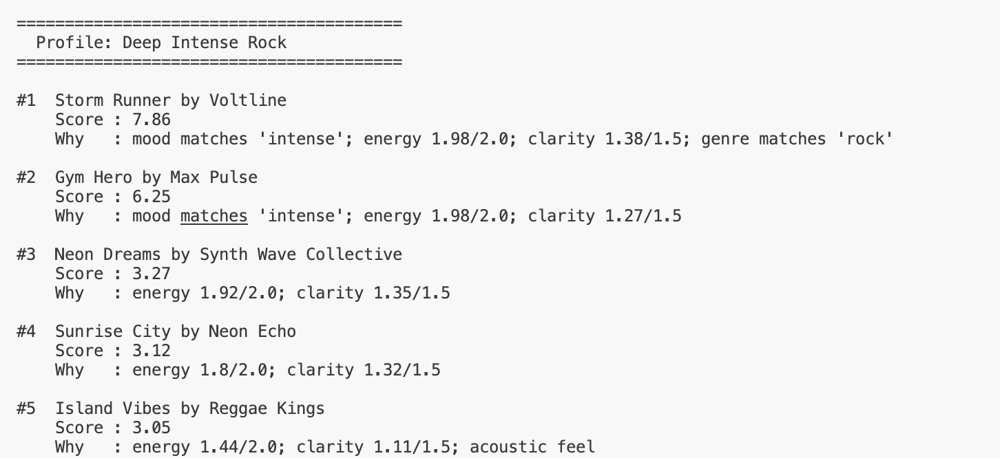
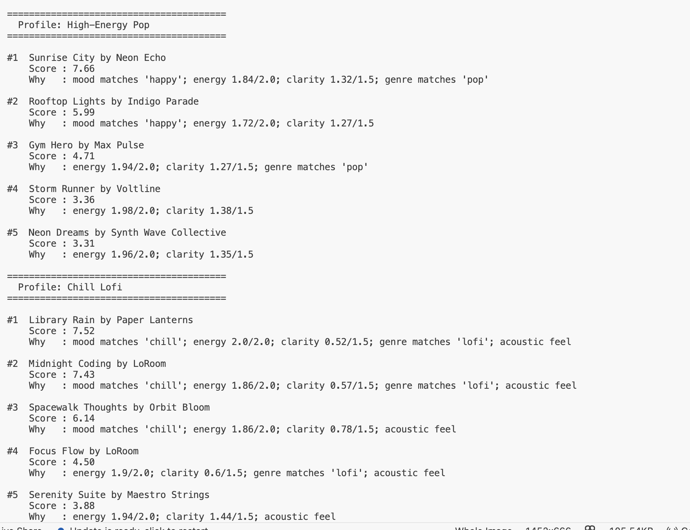

# 🎵 Music Recommender Simulation

## Project Summary

In this project you will build and explain a small music recommender system.

Your goal is to:

- Represent songs and a user "taste profile" as data
- Design a scoring rule that turns that data into recommendations
- Evaluate what your system gets right and wrong
- Reflect on how this mirrors real world AI recommenders

Replace this paragraph with your own summary of what your version does.

---

## How The System Works

Explain your design in plain language.

Some prompts to answer:

- What features does each `Song` use in your system
  - For example: genre, mood, energy, tempo
- What information does your `UserProfile` store
- How does your `Recommender` compute a score for each song
- How do you choose which songs to recommend

You can include a simple diagram or bullet list if helpful.
My version is a content-based recommender. Each Song has attributes — genre, mood, energy, valence, danceability, acousticness, and tempo — and each UserProfile stores a preferred genre, mood, target energy, and acoustic preference. Songs are scored using a weighted sum where mood alignment weighs the most, followed by energy closeness, clarity, genre match, and a small acoustic bonus. All songs are ranked by score and the top k are returned with an explanation for each pick. The algorithm recipe follows this order: mood match, energy closeness, valence (clarity), genre match, acoustic fit, weighted sum, sort descending, return top k. This system might over-prioritize mood, ignoring songs that nearly match on energy and vibe but carry a different mood label. Mood and genre are all-or-nothing, so near-synonyms like "chill" and "relaxed" score zero match even if they feel identical to a listener. There is also no diversity signal, so users with strong preferences will see the same cluster of songs every run.

---

## Getting Started

### Setup

1. Create a virtual environment (optional but recommended):

   ```bash
   python -m venv .venv
   source .venv/bin/activate      # Mac or Linux
   .venv\Scripts\activate         # Windows

2. Install dependencies

```bash
pip install -r requirements.txt
```

3. Run the app:

```bash
python -m src.main
```

### Running Tests

Run the starter tests with:

```bash
pytest
```

You can add more tests in `tests/test_recommender.py`.

---

## Experiments You Tried

Use this section to document the experiments you ran. For example:

- What happened when you changed the weight on genre from 2.0 to 0.5
- What happened when you added tempo or valence to the score
- How did your system behave for different types of users

Three user profiles were tested — High-Energy Pop, Chill Lofi, and Deep Intense Rock — each producing a clearly different ranked list, which confirms the scoring logic is actually responding to user preferences rather than returning the same songs every time. The High-Energy Pop profile surfaced Sunrise City and Rooftop Lights at the top because both match the happy mood and sit close to the 0.9 energy target. The Chill Lofi profile shifted entirely toward low-energy acoustic tracks like Library Rain and Midnight Coding, which score high on energy closeness and acoustic fit — songs that would rank near the bottom for the Pop profile. The Deep Intense Rock profile locked onto Storm Runner as a near-perfect match across every feature, while high-energy pop and lofi songs dropped out of the top results entirely because they failed the mood and genre checks. Three weight configurations (Default, Energy-First, Genre-Dominance) were also compared across all profiles. The most visible shift was in High-Energy Pop under Genre-Dominance, where Gym Hero jumped above Rooftop Lights because the genre bonus increased from 1.5 to 3.0 — rewarding the exact pop genre match more heavily than mood alone.

---

## Limitations and Risks

Summarize some limitations of your recommender.

Examples:

- It only works on a tiny catalog
- It does not understand lyrics or language
- It might over favor one genre or mood

You will go deeper on this in your model card.

---

## Reflection

Read and complete `model_card.md`:

[**Model Card**](model_card.md)

Write 1 to 2 paragraphs here about what you learned:

- about how recommenders turn data into predictions
- about where bias or unfairness could show up in systems like this

Real-world recommendation engines are built in layers separated into different models, profile data, validations, and signals. They gather user behavior (listens, skips, likes), item attributes (genre, mood, energy, tempo), and context (time of day, session type), then compute a relevance score for each candidate and sort to create a final ranked list. They rely on both collaborative signals (what similar listeners enjoyed) and content signals (how close songs are to a user's taste profile), with additional business and risk rules for diversity and freshness.

Building this showed me that a recommender is really just a scoring function. It takes numbers about a song and numbers about a user and does math to find the closest match. Apps like Spotify work the same way but at a much larger scale. They track what you skip, replay, save, and search for, then use that behavior to build a taste profile. They also use collaborative filtering, which means if thousands of people who love the same songs as you also love one song you have never heard, Spotify assumes you will too and pushes it to you. My system only uses song attributes and a fixed user profile, so it cannot learn from behavior the way Spotify can. Comparing the three profiles made it clear why that matters. When I ran High-Energy Pop vs Chill Lofi, the results flipped almost completely because the energy targets and mood labels are opposites. But Gym Hero kept showing up for Happy Pop listeners even though it is an intense workout song. The system just saw a high-energy pop match and rewarded it without understanding that happy and intense feel completely different to a real listener. That is where bias sneaks in.


---

## 7. `model_card_template.md`

Combines reflection and model card framing from the Module 3 guidance. :contentReference[oaicite:2]{index=2}  

```markdown
# 🎧 Model Card - Music Recommender Simulation

## 1. Model Name

Give your recommender a name, for example:

> VibeFinder 1.0

---

## 2. Intended Use

- What is this system trying to do
- Who is it for

Example:

> This model suggests 3 to 5 songs from a small catalog based on a user's preferred genre, mood, and energy level. It is for classroom exploration only, not for real users.

---

## 3. How It Works (Short Explanation)

Describe your scoring logic in plain language.

- What features of each song does it consider
- What information about the user does it use
- How does it turn those into a number

Try to avoid code in this section, treat it like an explanation to a non programmer.

---

## 4. Data

Describe your dataset.

- How many songs are in `data/songs.csv`
- Did you add or remove any songs
- What kinds of genres or moods are represented
- Whose taste does this data mostly reflect

---

## 5. Strengths

Where does your recommender work well

You can think about:
- Situations where the top results "felt right"
- Particular user profiles it served well
- Simplicity or transparency benefits

---

## 6. Limitations and Bias

Where does your recommender struggle

Some prompts:
- Does it ignore some genres or moods
- Does it treat all users as if they have the same taste shape
- Is it biased toward high energy or one genre by default
- How could this be unfair if used in a real product

---

## 7. Evaluation

How did you check your system

Examples:
- You tried multiple user profiles and wrote down whether the results matched your expectations
- You compared your simulation to what a real app like Spotify or YouTube tends to recommend
- You wrote tests for your scoring logic

You do not need a numeric metric, but if you used one, explain what it measures.

---

## 8. Future Work

If you had more time, how would you improve this recommender

Examples:

- Add support for multiple users and "group vibe" recommendations
- Balance diversity of songs instead of always picking the closest match
- Use more features, like tempo ranges or lyric themes

---

## 9. Personal Reflection

A few sentences about what you learned:

- What surprised you about how your system behaved
- How did building this change how you think about real music recommenders
- Where do you think human judgment still matters, even if the model seems "smart"


Recommendation output screenshot:




